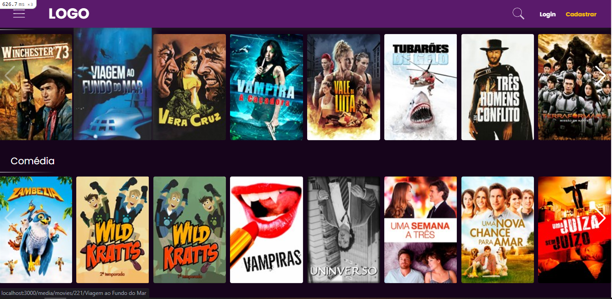
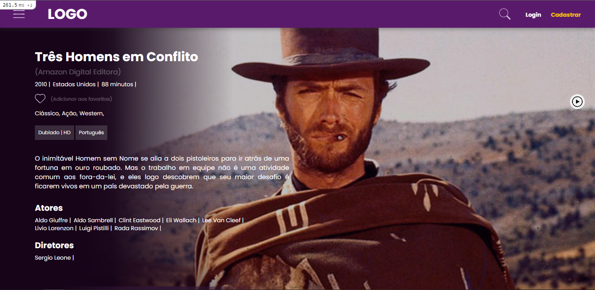

# Blockbuster Filmes

Blockbuster é um projeto feito em Ruby on Rails com o intuito de fortalecer o aprendizado, com ele é possível simular um aluguel de um filme com prazo de entrega com limite de aluguel, favoritar filmes, criar uma conta de usuário e fazer pesquisa por (filmes/atores/diretores)

## De onde veio todos esses filmes?

Criei um programa em python para fazer raspagem de dados de um certo site, todo o processo de busca, filtragens e limpeza de dados foram feito para que tudo ocorresse bem na hora de popular o banco de dados

## Ferramentas

#### Python
- biblioteca: [Os](https://docs.python.org/3/library/os.html) do python para criar as pastas necessárias
- biblioteca: [Time](https://docs.python.org/3/library/time.html) do python para esperar um certo tempo pra fazer a requisição
- biblioteca: [Requests](https://pypi.org/project/requests/) para fazer solicitações HTTP
- biblioteca: [Parsel](https://parsel.readthedocs.io/en/latest/index.html) para extrair dados HTML
- biblioteca: [Json](https://docs.python.org/3/library/json.html) do proprio python para tratar arquivos json

#### Ruby on Rails => Gems
- [Devise](https://github.com/heartcombo/devise) para fazer autenticação de usuário
- [Devise-i18n](https://github.com/tigrish/devise-i18n) para traduzir recursos do devise
- [Image_processing](https://github.com/janko/image_processing) para manipulação de imagens
- [Pg_search](https://github.com/Casecommons/pg_search) para fazer buscas
- [Rails-i18n](https://github.com/svenfuchs/rails-i18n) para traduções do rails em si
- [Rubocop](https://github.com/rubocop/rubocop) o nosso linter do rails
- [Better-erros](https://github.com/BetterErrors/better_errors) para deixar os erros mais elegantes


## Aprendizados
- Melhorei meu entendimento com Active Record
- Melhorei meu entendimento com relacionamento de tabelas no Rails
- Aprendi como funciona as configurações de tradução e pluralização
- Aprendi algumas palavras chaves para criação/edição/remoção/relacionamento de 'migrations'
- Reforcei meu entendimento do uso de rotas
- Aprendi como funciona o uso do JavasCript no Rails
- E adquiri um melhor conhecimento no uso de algumas gems que estão no projeto

## Iniciar aplicação

#### Se ainda não tem o ```Docker``` e ```Docker-compose``` instalado, click [aqui](https://docs.docker.com/engine/install/ubuntu/) para ver o passo a passo

### Hora de iniciar

Configurando o banco
- Crie um arquivo ```.env``` na raiz do projeto
- Coloque as seguintes configurações e salve o arquivo
```
    DATABASE_NAME=locadora
    DATABASE_USER=sammy
    DATABASE_PASSWORD=password
    DATABASE_HOST=database
```

#### ⚠️ Atenção: os comandos a seguir pode demorar um pouco para ser finalizados, então tenha paciência :)

##### Primeiro, compile as imagens de contêiner e crie os serviços, executando o ```docker-compose up``` com a flag ```-d```, que executará os contêineres em segundo plano:
```
docker-compose up -d
```

##### Você também pode obter informações mais detalhadas sobre os processos de inicialização nos logs do contêiner

```
docker-compose logs
```

##### Você também pode verificar o status dos seus contêineres com o docker-compose ps:
```
docker-compose ps
```

##### Em seguida, rode o seguinte comando para criar o banco de dados e criar as tabelas do banco (migrations)
```
docker-compose exec app bundle exec rake db:setup db:migrate
```

⚠️  Pode ser que o comando ```docker-compose exec app bundle exec rake db:setup db:migrate``` também popula o banco de dados, caso não esteja populando execute ```docker-compose exec app bundle exec rake db:seed```<br />




